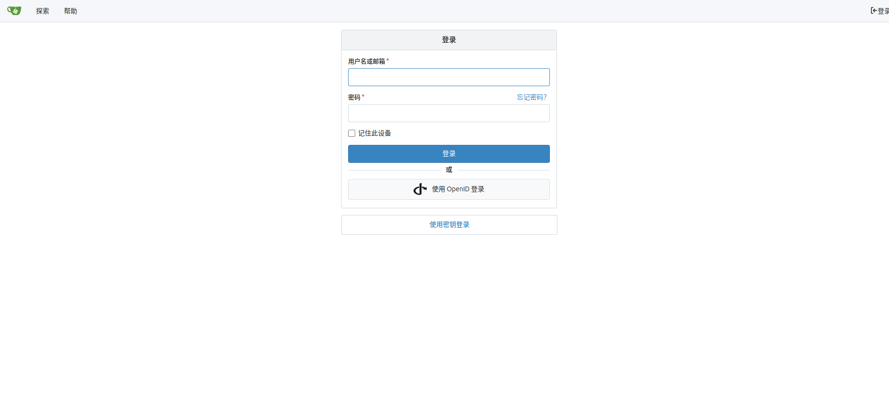
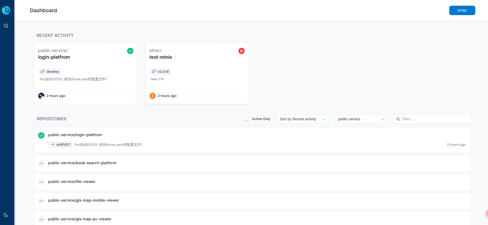

# 安装drone
**注意：当git仓库使用https使用 drone 也要使用https**
根据[官方文档](https://docs.drone.io/)]安装
* docker-compose.yaml 仅用于参考
```docker compose
version: '3.9'
services:
	drone-server:
		image: drone/drone:2.25.0
		container_name: drone-server
		restart: always
		dns:
		- 119.29.29.29
		volumes:
		- /storage/drone-volume/:/data
		environment:
		- DRONE_GITEA_SERVER=http://127.0.0.1:9090 # gitea仓库地址
		- DRONE_GITEA_CLIENT_ID=0cd27  # gitea客户id
		- DRONE_GITEA_CLIENT_SECRET=gto_v6hmtktutt # gitea客户密钥
		- DRONE_RPC_SECRET=a82d353bc1d32b8046c4e0b1b8ba5ad8 # 与drone-runner交互密钥
		- DRONE_SERVER_HOST=127.0.0.1
		- DRONE_SERVER_PROTO=http
		- DRONE_USER_CREATE=username:zengxh,admin:true # 配置管理员权限
		ports:
		- 80:80
		- 443:443
	drone-runner:
		image: drone/drone-runner-docker:1.8.3
		container_name: drone-runner
		restart: always
		dns:
		- 119.29.29.29
		volumes:
		- /var/run/docker.sock:/var/run/docker.sock
		environment:
		- DRONE_RPC_PROTO=http
		- DRONE_RPC_HOST=127.0.0.1
		- DRONE_RPC_SECRET=a82d353bc1d32b8046c4e0b1b8ba5ad8
		- DRONE_RUNNER_CAPACITY=2
		- DRONE_RUNNER_NAME=local-drone-runner
		ports:
		- 3000:3000
```

# 配置CI仓库
在浏览器访问`http://127.0.0.1`出现以下界面然后点击继续即可

登陆git仓库账号密码,后面要你填写公司信息 别填写，直接点提交

进入以下界面表示配置完成

# 编写配置文件
在项目的根路径下编写`Dockerfile`和`.drone.yaml` 文件
Dockerfile编写请参考[官方文档](https://docs.docker.com/reference/dockerfile/) 这里就不写了
以下是java 的后端CI/CD脚本
```
kind: pipeline  
type: docker  
name: test-minio-test  
  
trigger:  
  branch:  
    - develop  
  event:  
    - push  
  
steps:  
  - name: compile  
    image: maven:3.8.4-openjdk-11  
    volumes:  
      - name: maven-repository-cache  
        path: /root/.m2/repository  
      - name: maven-setting-file  
        path: /root/.m2/settings.xml  
    commands:  
      - mvn clean package -DskipTests  
  
  - name: build-push-image  
    image: docker:dind  
    volumes:  
      - name: docker-socket  
        path: /var/run/docker.sock  
    environment:  
      HARBOR_URL: harbor.changtech.cn  
      HARBOR_GROUP: test  
      HARBOR_USER:  
        from_secret: HARBOR_USERNAME  
      HARBOR_PASSWORD:  
        from_secret: HARBOR_PASSWORD  
    commands:  
      # 登录 Harbor      
      - docker login -u $HARBOR_USER -p $HARBOR_PASSWORD $HARBOR_URL  
      - IMAGE_URL=$HARBOR_URL/$HARBOR_GROUP/${DRONE_STAGE_NAME}:test-ci-${DRONE_BUILD_NUMBER}  
      # 构建镜像  
      - docker build -t $IMAGE_URL --build-arg envType=test .  
      # 推送镜像  
      - docker push $IMAGE_URL  
      # 删除镜像  
      - docker rmi $IMAGE_URL  
  
  - name: deploy  
    image: appleboy/drone-ssh:1.8  
    settings:  
      host:  
        - 172.16.0.1  
      username: drone  
      password:  
        from_secret: SERVER_PASSWORD  
      command_timeout: 2m  
      script:  
        # 定义变量  
        - NAME_SPACE=default  
        - PROJECT_NAME=${DRONE_STAGE_NAME}  
        - HARBOR_URL=harbor.changtech.cn  
        - HARBOR_GROUP=test  
        - TAG=test-ci-${DRONE_BUILD_NUMBER}  
        - IMAGE_URL=$HARBOR_URL/$HARBOR_GROUP/$PROJECT_NAME:$TAG  
        # 开始部署  
		
  
  - name: ding-talk  
    image: lddsb/drone-dingtalk-message:1.2.9  
    settings:  
      token:  
        from_secret: DINGTALK_ACCESS_TOKEN  
      secret:  
        from_secret: DINGTALK_SECRET  
      type: markdown  
      success_color: 00a5ff  
      failure_color: e60000  
      tpl_build_status_success: '成功'  
      tpl_build_status_failure: '失败'  
      tpl: /opt/ding-talk-template.tpl  
    volumes:  
      - name: ding-talk-template  
        path: /opt/ding-talk-template.tpl  
    when:  
      status: [success,failure]  
  
volumes:  
  - name: docker-socket  
    host:  
      path: /var/run/docker.sock  
  - name: maven-repository-cache  
    host:  
      path: /storage/drone-workspace-volume/maven/repository  
  - name: maven-setting-file  
    host:  
      path: /storage/drone-workspace-volume/maven/settings.xml  
  - name: ding-talk-template  
    host:  
      path: /storage/drone-workspace-volume/ding-talk/test-template.tpl
```