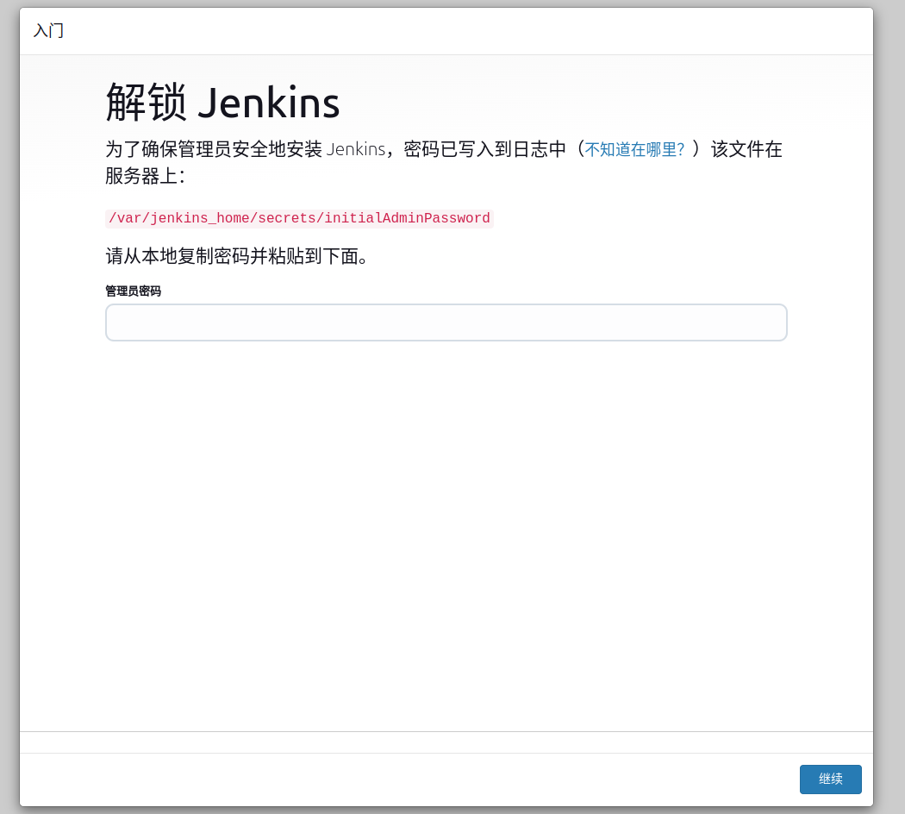
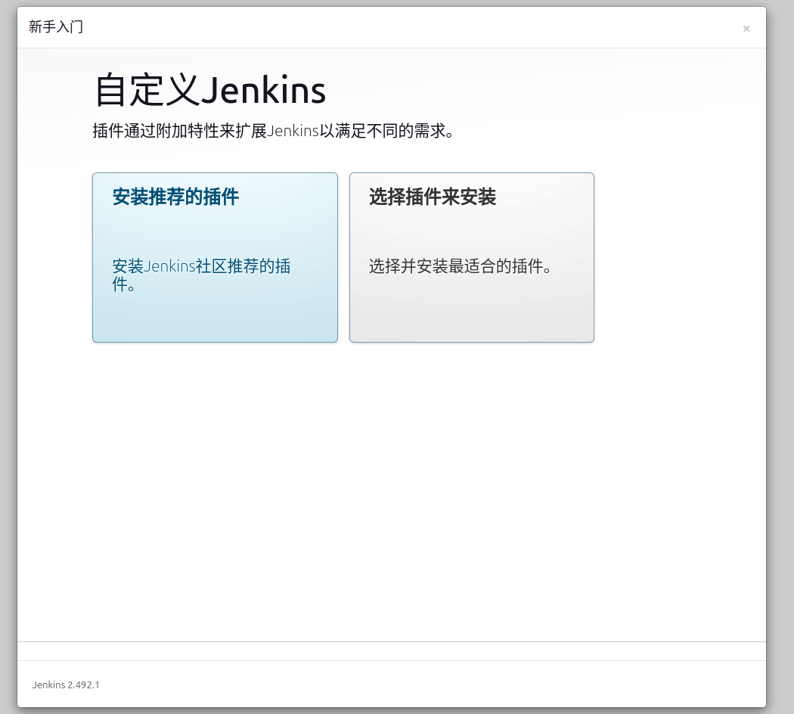
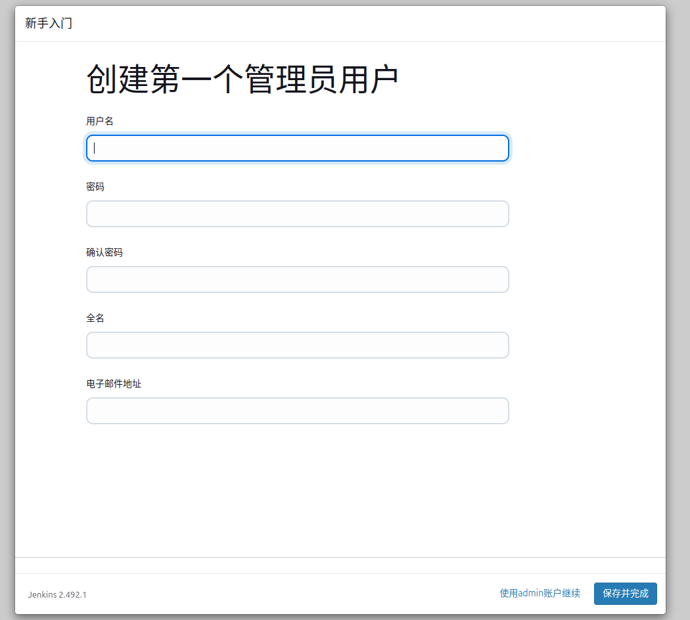
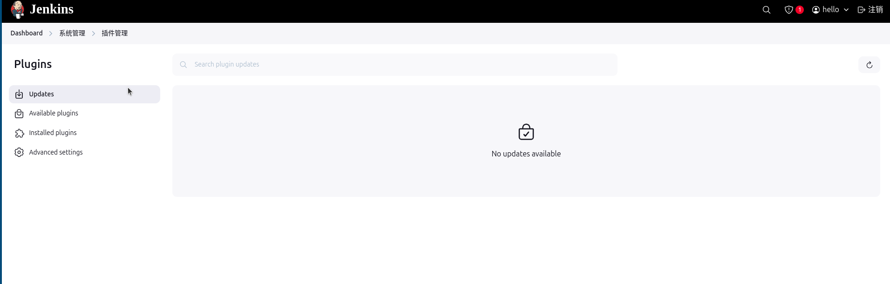

# jenkins安装
## 原有镜像没有权限 自制作带权限的镜像
```
构建镜像给与授权
FROM jenkins/jenkins:2.492.1
USER root
```
## 使用docker compose 安装
```
version: '3.9'
services:
  jenkins:
    container_name: jenkins
    image: jenkins/jenkins:2.492.1
    restart: always
    environment:
     - JAVA_OPTS=-Duser.timezone=Asia/Shanghai
    volumes:
     - "/storage/jenkins-volume/jenkins-data:/var/jenkins_home"
     - "/storage/jenkins-volume/work-tools:/opt/work-tools"
     - "/var/run/docker.sock:/var/run/docker.sock"
     - "/usr/bin/docker:/usr/bin/docker"
    ports:
     - 9090:8080
```
使用命令启动后，等代即可  
```
docker compose -f docker-compose.yaml up -d
```
## 配置jenkins
### 解锁jenkins
用浏览器访问http://127.0.0.1:9090,等待加载完毕 ,会出现以下画面

解锁jenkins。获取密钥有两个方法
- 使用 **docker logs jenkins**查看日志获取密钥
- 使用**docker exec -it jenkins /bin/bash**进入容器 再使用 **cat /var/jenkins_home/secrets/initialAdminPassword**获取密钥
### 使用默认插件
**注意：这个步骤很需要时间请耐心等待，大约要5-15分钟左右**
使用密钥进入后选择 *安装推荐的插件*  按钮

选择后会出现以下情况,等待即可

### 创建第一个用户
根据需求创建第一个用户

### 进入控制面板
一直点下一步即可

### 安装所需插件
进入插件管理的点击流程
**系统管理->插件管理**
进入以下界面即可

选择 **Available plugins**，搜索以下插件安装
- Generic Webhook Trigger 用于webhook监听仓库
- Git plugin 
- Maven Integration
- NodeJs 用于打包前端项目